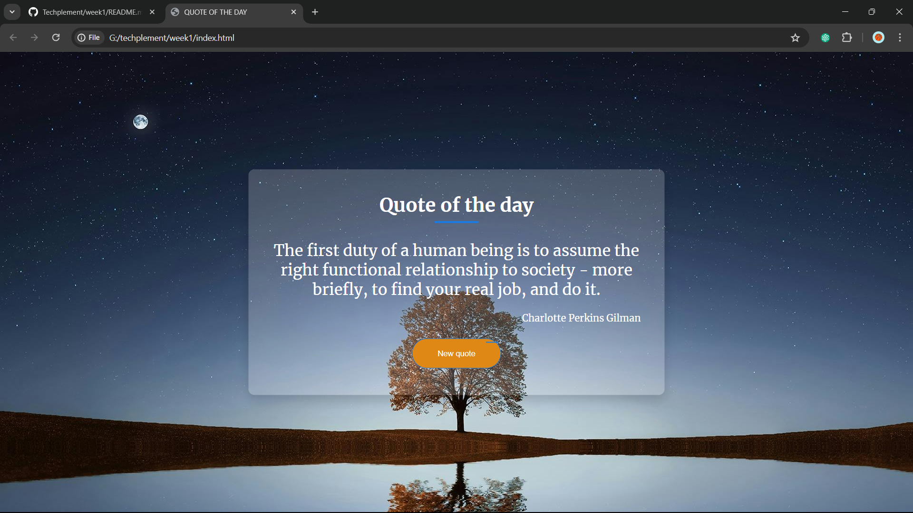

This HTML document presents a stylish "Quote of the Day" feature. It combines HTML, CSS, and JavaScript to create an interactive and visually appealing interface.

The CSS styling defines a semi-transparent quote box positioned centrally on the page with a background image. The Merriweather font family is imported from Google Fonts, enhancing the aesthetic appeal. The quote itself is displayed in a larger font size with a distinct bottom border, while the author's name appears below.

JavaScript handles the dynamic content generation. Upon loading, it fetches a random quote from the Quotable API (https://api.quotable.io/random) asynchronously. The fetched data, including the quote and its author, is then displayed within the designated HTML elements.

Additionally, a button labeled "New Quote" allows users to fetch and display a new random quote interactively, providing a fresh experience with each click. This code demonstrates a simple yet effective way to integrate dynamic content into a webpage, offering users a daily dose of inspiration or reflection.
THIS IS THE FINAL OUTPUT 

